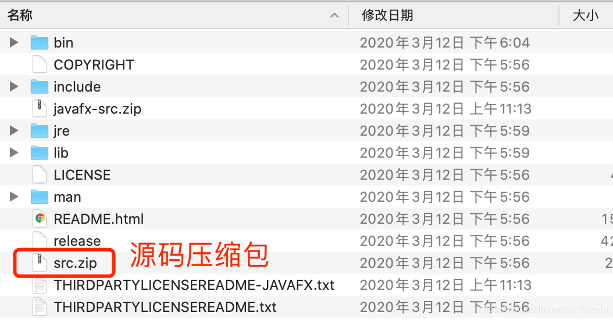
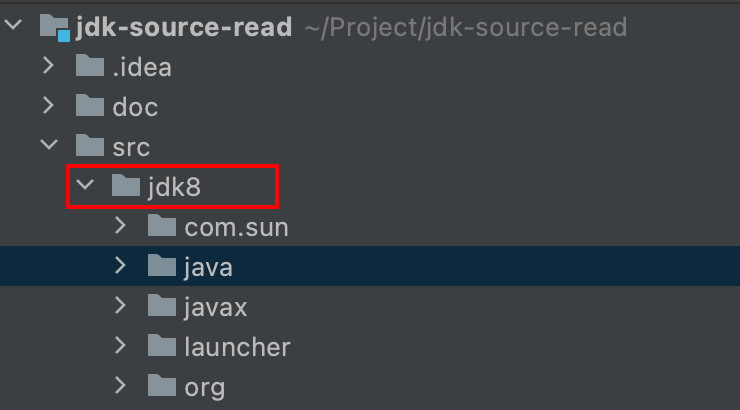
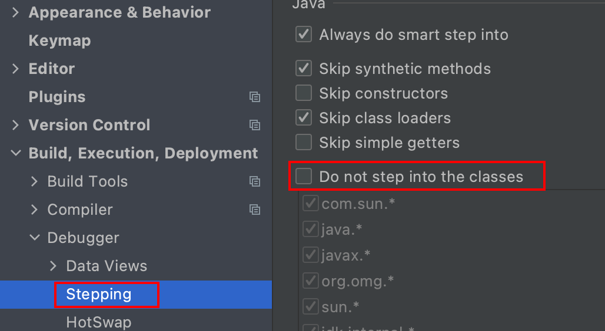
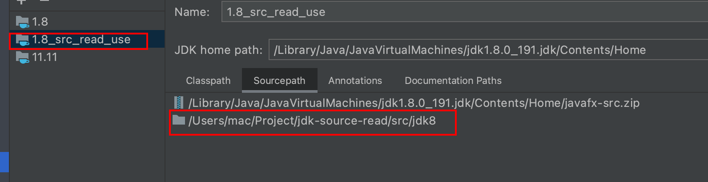
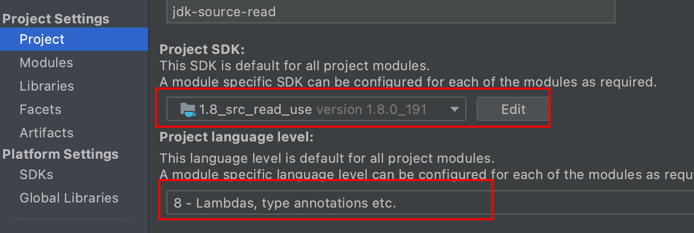

# jdk-source-read
Jdk  source read. Maybe funny.

# How config this project!!

## find the jdk src.zip from the jdk home

## Unzip the contents of src.zip to the jdk8 directory

## Set Idea "Do not step into classes"

## Add custom SDK

## Switch the SDK of the project to 1.8_src_read_use

- jdk version 1.8_191
